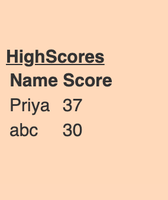

# Quiz_Contest

## Description
This is a quiz application using HTML, CSS, and Javascript. This application emphasizes the use of Javascript to provide quiz questions and collect user data to determine whether the answers to a question are correct, this then generates a score and appends that into the scores data.The timer starts When you click the "Start Quiz". Answering quickly and correctly results in a higher score. Answering incorrectly results in a time penalty and a lower score.HTML and CSS and Javascript documents create a quiz with multiple choice questions with Javascript trivia.

## Table of Contents 

* [Installation](#Installation)
* [Technologies Used](#Technology)
* [Psuedo code](#Psuedocode)
* [Summary](#Summary)
* [Tests](#Tests)
* [ResourceReffered](#ResourceReffered)
* [Github_Links](#Github_Links)

## Installation
To install this code, download the zip file, or use GitHub's guidelines to clone the repository., Links are provided below in resources.

## Technologies Used
1.JavaScript 
2.HTML 
3.CSS

## Psuedo code
Create a timer attached to a start button with a starting value of 60.
When start button  is pressed start a reverse countdown
When countdown starts, start quiz
Append the question: choices
When user selects the right answer, textcontent "Correct!"
When user selects the right answer, textcontent "Wrong!"
Final score will keep track of how many the user got right
Left over time will be deducted from final score
Final Score Appended page
Captures local storage
Travels to another HTML
Retrieved highscores
This project has script features of:
Questions contained in an array variable with objects
Variable declaration area
An event listener (onclick) that generates time interval
A function to render the questions and choices on the page using a for loop
An event listener on all list choices
A comparison statement to compare correct answers to choices
An appended page showing the final stats of the individual user with input area for initials, captures local storage
Highscores retreived local storage
This project has media Queries for:
max-width: 980px
Adjusts body and container width
max-width: 786px
Adjusts body and container width
Adjusts buttons
max-width: 640px
Adjusts body and container width
Adjusts buttons to be centered and stacked
To Execute File:
Open in browser

## Summary
This project emphasizes the use of using Javascript to make dynamic changes to an HMTL document
This project utilizes the use of appending HTML pages
This project has the following features:
A Start Quiz button
This starts a timer for the user
Total time for the Quiz is 60 Sec
An appended HTML page that features questions, and multiple choice answers
If questions are answered incorrectly, 10 seconds are deducted off remaining time
Answers are recording using an event listener, "click" and tracks correct answers.

## Tests 
### ScreenShots
This is the main page screen.

When you get the answer correct.

When you get the answer wrong.

Game is over, either its time over or its out of questions.

Submitting your initials to get the scores stored.

## ResourceReffered
[For Time Interval] https://www.w3schools.com/jsref/met_win_setinterval.asp  
[For Quiz concepts] https://stackoverflow.com/questions/3275164/javascript-quiz 

## Github_Links
[**URL of My Github Repository**](https://github.com/guptaria/Quiz_contest) 
[**URL of Deployed Application**](https://guptaria.github.io/Quiz_contest/.)

